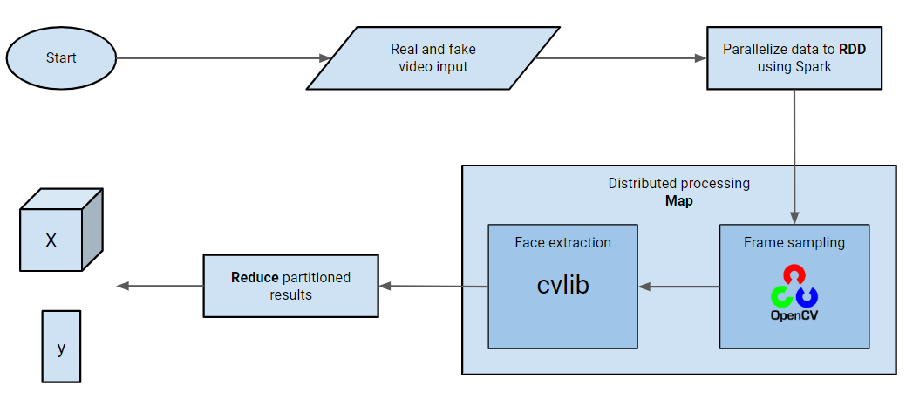
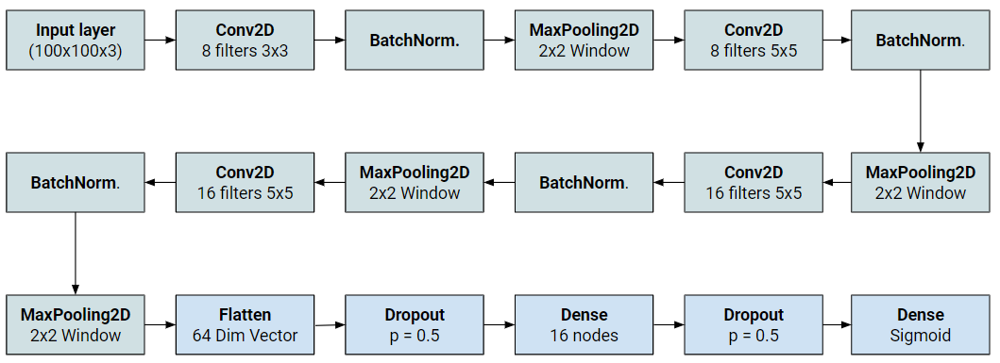
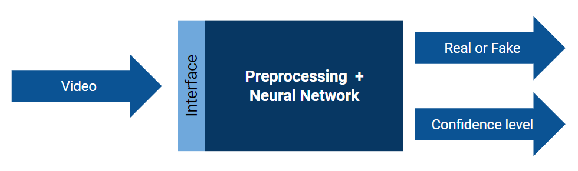

# Deepfake-Detection
Using the big data engine Apache Spark to preprocess and Keras to train a Convolutional Neural Network based on a labelled [dataset](https://ai.googleblog.com/2019/09/contributing-data-to-deepfake-detection.html) of deepfakes and real videos. 

The project is done as a part of the module "CS4225/CS5425 Big Data Systems for Data Science" at the National University of Singapore.

## Prerequisites
* OpenCV: ```pip install opencv-python```
* CVLib: ```pip install cvlib```
* Pyspark: ```pip install pyspark``` (and some other configurations)
* Numpy: ```pip install numpy```
* Keras: ```pip install keras```
* Tensorflow: ```pip install tensorflow```
* MatPlotLib: ```pip install matplotlib```
* Pydot: ```pip install pydot```

Or simply:

```pip install opencv-python cvlib pyspark numpy keras tensorflow matplotlib pytdot```

## Dataset
The dataset should be stored in a folder named *data*, using the dataset gathered with these instructions:
https://github.com/ondyari/FaceForensics/blob/master/dataset/README.md

The preprocessing is now done with the assumption that the following commands are run:

```python download-FaceForensics.py path/to/project/data -d DeepFakeDetection -c c23 -t videos```

and

```python download-FaceForensics.py path/to/project/data -d DeepFakeDetection_original -c c23 -t videos```

## Preprocessing
The preprocessing is distributed with pyspark. It can be run locally, standalone or in a cluster.

The following command can be used when in standalone mode (after setting up master and workers):

```
spark-submit 
--conf spark.driver.memory=8g 
--conf spark.executor.memory=8g 
--conf spark.memory.offHeap.enabled=true 
--conf spark.memory.offHeap.size=8g 
--conf spark.driver.maxResultSize=8g
--master local[*] spark_preprocess.py
```

This runs the preprocessing with the default parameters, and stores the result in two numpy arrays; X and y.
X contains samples faces and y contains their corresponding label of real or fake. 



The real videos will have a higher amount of samples in order to balance the labels.

## Convolutional neural network
The model is a CNN, and can be trained in CNN.py or the notebook (with plotting) train_model.ipynb

It has the following architecture:



## How to use
The trained model can be used with a command line interface:

```python predict.py --path <path-to-video>```

This will output the classification of real or fake, and how confident the decision is.

